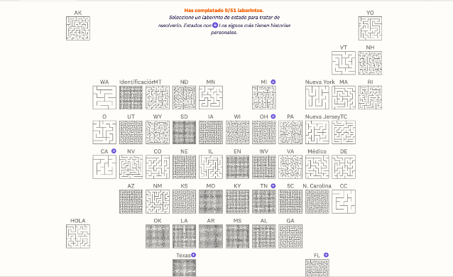
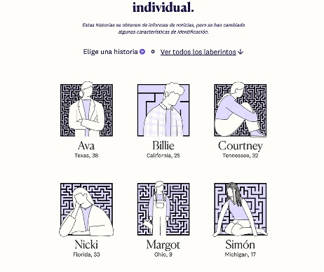

# Tarea 1 Narración Grafica
## Lucía Figari
### Abortion Mazes (The Pudding)
https://pudding.cool/2024/10/abortion-mazes/

**Descripción de la historia que cuenta:**

La idea central de esta webstory es el aborto en Estados Unidos y cómo este tema no ha seguido un camino lineal en el tiempo. La narración comienza relatando el inicio del derecho nacional del aborto en 1973, a través del fallo histórico de Roe v. Wade, y continúa explicando cómo, en 2022, la Corte Suprema decidió otorgar a cada estado la facultad de restringir o prohibir este derecho, marcando así un antes y después en la vida de las mujeres y la libertad sobre su cuerpo.
La propuesta narrativa presenta de forma innovadora la información mediante recursos visuales y simbólicos, tal como un laberinto. Mientras el lector intenta resolver el recorrido, se cuenta una historia distinta para cada estado. La extensión y complejidad del laberinto representa el grado de dificultad que enfrenta cada persona al intentar acceder a un aborto en dicho lugar.   
Así, cuanto más enredado resulta el camino, más engorroso es la batalla que esa mujer atravesó para poder ejercer un aborto. 

**Explica por qué te pareció interesante y qué aspectos destacarías de su estructura narrativa:**

El aborto, sin lugar a duda, es un tema controversial y difícil de abordar, ya que involucra tanto temas valóricos, religiosos y sociales. En mi opinión, las mejores formas de lograr conciencia sobre este tema, especialmente en los medios de comunicación, es a través de datos objetivos y de los testimonios humanos. La webstory consigue un equilibrio entre ambos elementos: aunque no presenta una gran cantidad de datos, entrega información básica necesaria para comprender el contexto de la problemática. Sin embargo, logra exponer historias íntimas que humanizan el aborto de manera respetuosa.
Otro aporte de la propuesta es la manera en que se relaciona la prohibición del aborto y los obstáculos que enfrentan las mujeres en el proceso, esto mediante recursos visuales y gráficos. El laberinto funciona como metáfora y como una experiencia sensorial: mientras más difícil es hallar la salida, se crea en el lector una desesperación que se podría asimilar (en una menor medida) con aquella que experimentan las mujeres al acceder a este derecho en un entorno restrictivo.
La información inicial está presentada de manera simple y clara, lo que facilita la comprensión inicial del tema. El objetivo principal no es otorgar un sinfín de estadísticas, sino generar empatía y comprensión humana del problema.
Cada relato por estado refuerza la idea de que no existe una experiencia única frente a esta situación, sino que cada mujer vive un contexto e historia distinta, donde se tienen dificultades particulares. A pesar de tener caminos distintos, todos estos conllevan un nivel de complejidad.
La estética de la webstory va acorde con los simbolismos de esta lucha. El color predominante es el morado, el cual ha sido representativo de la batalla de legalización del aborto. 

**Evaluación de la efectividad para transmitir información:**

En mi opinión, la experiencia genera en el lector empatía hacia cada situación presentada. La elección de mostrar una historia por estado permite dimensionar que, más allá del contexto vivido, la decisión de llevar a cabo un aborto no es simple. La webstory logra transmitir que las restricciones de este derecho multiplican los obstáculos que las mujeres deben vivir.

